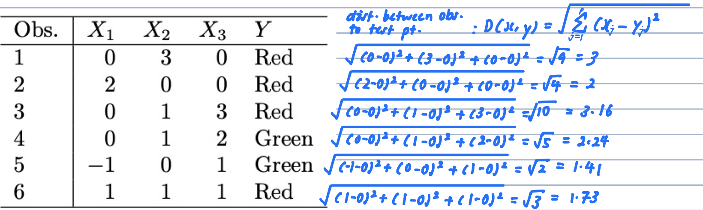
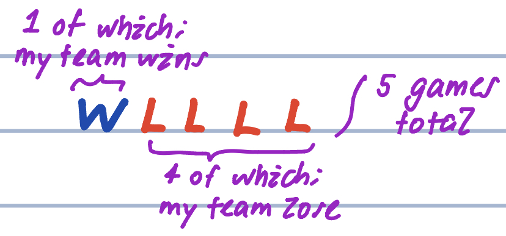
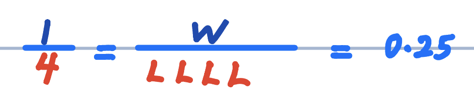
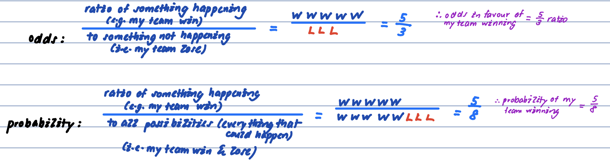
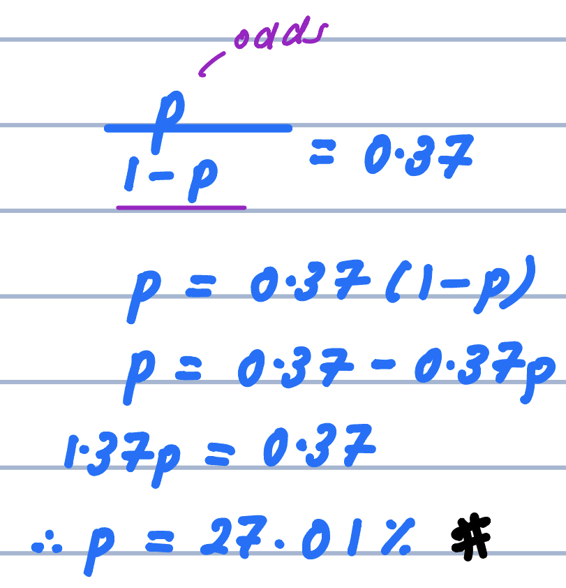
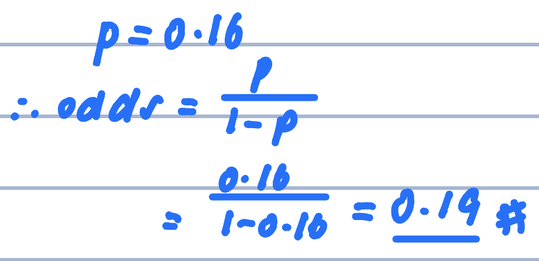
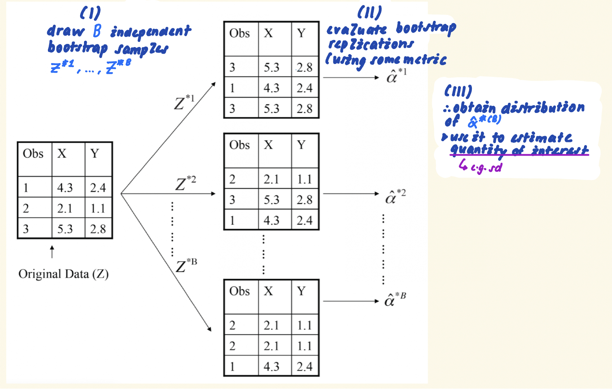
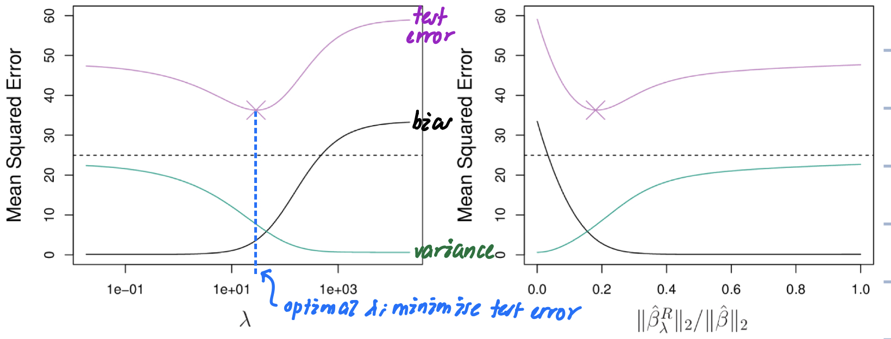

```{r setup, include=FALSE}
knitr::opts_chunk$set(echo = TRUE)

# --- load library
library(tidyverse); ggplot2::theme_set(theme_bw())
```
# chapter 2: statistical learning

## Ex.7. (p.52)

      create data frame
```{r}
df <- tibble(x1 = c(0, 2, 0, 0, -1, 1),
             x2 = c(3, 0, 1, 1, 0, 1),
             x3 = c(0, 0, 3, 2, 1, 1),
             y = c("red", "red", "red", "green", "green", "red"))
```

```{r}

```


# chapter 3: linear regression

### a. 
      
      write out linear regression model
$$\hat{Y} = 50 + 20.GPA + 0.07.IQ + 35.Gender + 0.01.GPA*IQ -10.GPA*Gender$$
      
      for male (gender = 0)
$$\hat{Y} = 50 + 20.GPA + 0.07.IQ + 35\color{yellow}{.0}  + 0.01.GPA*IQ -10.GPA*\color{yellow}0$$
      
      for female (gender = 1)
$$\hat{Y} = 50 + 20.GPA + 0.07.IQ + 35\color{yellow}{.1} + 0.01.GPA*IQ -10.GPA*\color{yellow}1$$
      
### b.

      linear model: 
      
$$\hat{Y} = 50 + 20.GPA + 0.07.IQ + 35.Gender + 0.01.GPA*IQ -10.GPA*Gender$$


      simply plug in values: 
      
$$\hat{Y} = 50 + 20.\color{yellow}{4} + 0.07.\color{yellow}{110} + 35.\color{yellow}{1} + 0.01.\color{yellow}{4}*\color{yellow}{110} -10.\color{yellow}{4}*\color{yellow}{1}= 137.1$$


# chapter 4: classification

## what is odds vs. probability?

      what is odds?
•odds is simply the ratio of something happening to something not happening
•e.g. odds in favour of my team winning the game is 1 to 4
-> i.e. odds are $1$to $4$
```{r}
# --- odds


# --- odds written as fraction

```

      comparing odds& probability
```{r}

```
      
### a.
```{r}

```


```{r}

```


# chapter 5: resamping methods

## Ex.4 (p.198)

•using bootstrap

(I) draw $B$ independent bootstrap samples $X^{*(1)}\dots X^{*(b)}_n$ from the data $\hat{P}$
*i.e. sample with replacement

$$X^{*(1)} \dots X^{*(b)}_n \sim \hat{P}; where\ b = 1,\dots,B$$


(II) make predictions; on each bootstrap replication: 

$$\hat{p}^{*(b)} = f(X^{*(b)});\ where\ b=1,\dots,B$$
(III) use distribution of $\hat{p}^{*(b)}$; to estimate standard error $s$

$$\hat{s} = \sqrt{\frac{\sum^{B}_{i=1}(\hat{p}-\bar{p})}{B}}$$

      illustration of general bootstrap procedure to compute quantity of interest from bootstrap samples
```{r}

```

# chapter 6: shrinkage methods methods

## Ex4. (p.260)

      illustrate what happens to test error, bias & variance; as $\lambda$ increases (L8B slide 24)
```{r}

```


      
# chapter 7: moving beyond linearity

## Ex.3. (p.298)
```{r}
# --- create b2 basis function
b2_func <- function(x){
  
  if(x >= 1) {
    (x - 1)^2 
  } else {
    
    0
  }
}

# --- create y (function of x & \beta params.)
y_func <- function(x) {
  
  1 + 1*x + -2*b2_func(x)
  }
  
tibble(x = seq(from = -2, to = 2, by = 0.25)) %>% 
  rowwise() %>% 
  mutate(y = y_func(x)) %>% 
  ggplot(aes(x = x,
             y = y)) +
  geom_point() 
  
```

# chapter 8: tree-based methods

## Ex.5. (p.332)

```{r}
p <- c(0.1, 0.15, 0.2, 0.2, 0.55, 0.6, 0.6, 0.65, 0.7, 0.75)
```

      1. based on majority vote
•classify as red; if majority vote in favour of red
```{r}
sum(p > 0.5) > sum(p < 0.5)
```
      
      2. based on avg. probability
•classify as red; if avg. probability > 0.5
```{r}
mean(p)
```

# chapter 9: support vector machines

## Ex9. (p.368)

### a. 

$1 + 3X_1 - X_2 = 0$

      sketch hyperplane $1 + 3X_1 - X_2 = 0$; indicate points for which $1 + 3X_1 - X_2 > 0$ & $1 + 3X_1 - X_2 < 0$
```{r}
# --- Part (a)

# Compute x2 using values from x1
compute_x2 <- function(x1) {
    
  1 + 3 * x1
  }

# Generate data 
part_a <- tibble(x1_a = seq(-5, 5, by = 1)) %>% 
  rowwise() %>% 
  mutate(x2_a = compute_x2(x1_a)) %>% 
  ungroup()  

p <- part_a %>% 
  ggplot() +
  # Emphasise zero line
  geom_hline(yintercept = 0,
             colour = "grey50",
             size = 2,
             alpha = 0.3) +
  # Draw hyperplane for part (a)
  geom_line(aes(x = x1_a,
                y = x2_a),
            colour = "steelblue",
            size = 1) +
  # Include text indicating part(a)
  geom_text(data = part_a %>% filter(x1_a == max(x1_a)),
            aes(x = x1_a + 1,
                y = x2_a),
            label = "part a") +
  labs(x = "x1",
       y = "x2")
p
```

### b.

      sketch hyperplane $-2 + X_1 + 2X_2 = 0$; indicate points for which $-2 + X_1 + 2X_2 < 0$ & $-2 + X_1 + 2X_2 > 0$
```{r}
# --- Part (b)

# Compute x1 using values from x2
compute_x1 <- function(x2) {
  
  2 - 2 * x2
  }

# Generate data 
part_b <- tibble(x2_b = seq(-5, 5, by = 1)) %>% 
  rowwise() %>% 
  mutate(x1_b = compute_x1(x2_b), .before = x2_b) %>% 
  ungroup()

p +
  # draw hyperplane for part (b)
  geom_line(data = part_b,
            aes(x = x1_b,
                y = x2_b),
            size = 1,
            colour = "salmon") +
  # Include text indicating part(b)
  geom_text(data = part_b %>% filter(x1_b == max(x1_b)),
            aes(x = x1_b + 1,
                y = x2_b),
            label = "part b")
```


# chapter 10: unsupervised classification

## Ex.2 (p. 413)

      create distance matrix
```{r}
# --- create distance matrix
dist_mat <- matrix(c(0, 0.3, 0.4, 0.7,
                 0.3, 0, 0.5, 0.8,
                 0.4, 0.5, 0, 0.45,
                 0.7, 0.8, 0.45, 0),
               byrow = TRUE,
               ncol = 4) %>% 
  stats::as.dist()
```

### a. + c.

      run hclust; using complete linkage
```{r}
# --- run `hclust`; using complete linkage
complete_hclust <- dist_mat %>% 
  stats::hclust(method = "complete")
```

      draw dendogram
```{r}
# --- method 1:
complete_hclust %>% 
  ggdendro::ggdendrogram(rotate = TRUE, # horizontal
                         size = 4) # font size

# --- method 2: 
factoextra::fviz_dend(x = complete_hclust,
                      k = 2, # cutree @ k = 2
                      k_colors = c("#2E9FDF", "#00AFBB", "#E7B800", "#FC4E07"),
                      color_labels_by_k = TRUE, 
                      rect = TRUE,
                      rect_fill = TRUE,
                      ggtheme = theme_bw())
```
      
### b. + d.

      run hclust; using single linkage
```{r}
# --- run `hclust`; using single linkage
single_hclust <- dist_mat %>% 
  stats::hclust(method = "single")
```

      draw dendogram
```{r}
single_hclust %>% 
  ggdendro::ggdendrogram(rotate = TRUE, # horizontal
                         size = 4) # font size

# yet another way
factoextra::fviz_dend(x = single_hclust,
                      k = 2, # cut tree @ k = 2
                      k_colors = c("#2E9FDF", "#00AFBB"),
                      color_labels_by_k = TRUE, 
                      rect = TRUE,
                      rect_fill = TRUE,
                      ggtheme = theme_bw())
```
      
### e.
use your imagination


