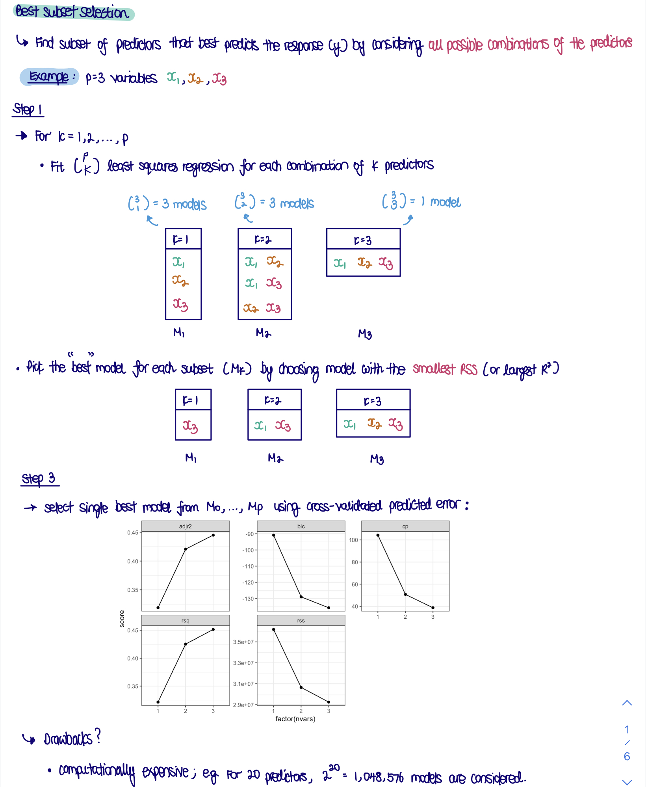
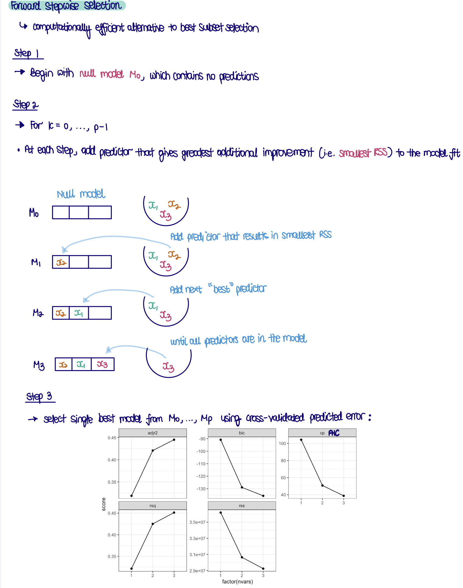
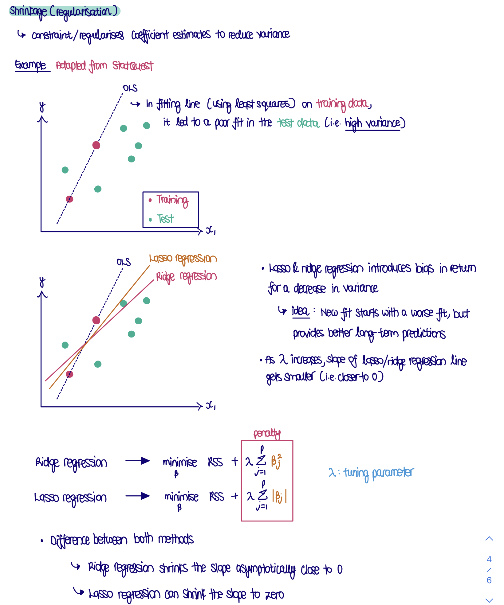

```{r, echo = FALSE, message = FALSE, warning = FALSE, warning = FALSE}
knitr::opts_chunk$set(
  message = FALSE,
  warning = FALSE,
  error = FALSE, 
  collapse = TRUE,
  comment = "#",
  fig.height = 4,
  fig.width = 8,
  fig.align = "center",
  cache = FALSE
)

# --- load libraries
library(knitr)
library(tidyverse); ggplot2::theme_set(theme_bw())
library(ISLR)
library(skimr)
library(leaps)
library(patchwork)
library(rsample)
library(tidymodels)
library(glmnet)
```

## `r emo::ji("target")` Objective

### 1. Choosing variables

Work your way through the textbook lab 6.5.2 Best Subset Selection, and the forward stepwise procedure in 6.5.2, then answer these questions.

      read in data + skimr::skim
```{r}
# read in data ISLR::Hitters
data(Hitters)
```

      skim data + handle missing data on `Salary`; by removing them
```{r}
# skim data
skimr::skim(Hitters)

# handle missing values on `Salary`; by removing them
Hitters <- Hitters %>%
  filter(!is.na(Salary))
```

#### a. The `regsubsets()` function (part of the `leaps` library) performs best subset selection by identifying the best model that contains a given number of predictors, where best is quantified using RSS. By default it only examines up to 8 variable models. Which variables make the best 8 variable model?

      image illustrating best subset selection
```{r}

```
      

      run subset selection
```{r}
# --- run subset selection
regfit.full <- leaps::regsubsets(Salary ~ .,
                                 data = Hitters,
                                 nvmax = 8, # default: up to k = 8 models
                                 method = "exhaustive") # fit (p = 19 choose k = 8) models!

summary(regfit.full) # best model when k = 1, k = 2, ..., k = 8
```

      compute no. of models fitted!
•at each `k`; we fit $p \choose k$ linear models!
```{r}
# total no. of linear models fitted models = 169, 765!
total <- 0 

for(k in 1:8){
  k_no_models <- choose(n = 19,
                        k = k)
  
  total <- total + k_no_models
}
```

      extract coefficients of model; where k(no. of predictors) = 8 
```{r}
regfit.full %>% 
  stats::coef(id = 8)
```

#### b. Set the max number of variables to be 19, by adding the argument `nvmax=19`. Plot the model fit diagnostics for the best model of each size. What would these diagnostics suggest about an appropriate choice of models? Do your results compare with the text book results? Why not?

      repeat best subset selection algorithm as per above; for up to k = 19 variables
```{r}
regfit.full <- leaps::regsubsets(Salary ~ .,
                                 data = Hitters, 
                                 nvmax = 19, # up to k = 19
                                 method = "exhaustive") # fit (p = 19 choose k = 19) models!


reg.summary <- summary(regfit.full)
```
 
      
      compute no. of models fitted!
•at each `k`; we fit $p \choose k$ linear models!
```{r}
# total no. of linear models fitted models = 524, 287! 
total <- 0 

for(k in 1:19){
  k_no_models <- choose(n = 19,
                        k = k)
  
  total <- total + k_no_models
}
```
 
      what model diagnostics available?
```{r}
reg.summary <- summary(regfit.full) 

names(reg.summary)
```

      extract & plot model fit statistics; for best model for each k from 1 to 19
•note: cannot compare RSS or R^2; since they will decrease; if k increase
```{r}
models <- tibble(nvars = 1:19, # k
                 # extract model fit diagnostics; for best fit at each k from 1 to 19
                 rsq = reg.summary$rsq, # r-squared 
                 rss = reg.summary$rss, # rss
                 adjr2 = reg.summary$adjr2, # adj. r-squared
                 cp = reg.summary$cp, # Mallows C_p
                 bic = reg.summary$bic) # BIC

# --- plot model fit diagnostics against k (no. of vars.)
p1 <- models %>% 
  ggplot(aes(x = nvars, 
             y = rsq)) +
  geom_line() +
  geom_point() +
  # colour optimal pt. red (minimise rsq)
  geom_point(colour = "red",
             data = models %>% slice_max(rsq, n = 1))

p2 <- models %>% 
  ggplot(aes(x = nvars, y = rss)) + 
  geom_line() +
  geom_point() +
  # colour optimal pt. red (minimise rss)
  geom_point(colour = "red",
             data = models %>% slice_min(rss, n = 1))

p3 <- models %>% 
  ggplot(aes(x = nvars, 
             y = adjr2)) + 
  geom_line() +
  geom_point() +
  # colour optimal pt. red (maximise adjr2)
  geom_point(colour = "red",
             data = models %>% slice_max(adjr2, n = 1))

p4 <- models %>% 
  ggplot(aes(x = nvars, 
             y = cp)) +
  geom_line() +
  geom_point() +
  # colour optimal pt. red (minimise cp)
  geom_point(colour = "red",
             data = models %>% slice_min(cp, n = 1))

p5 <- models %>% 
  ggplot(aes(x = nvars,
             y = bic)) + 
  geom_line() +
  geom_point() +
  # colour optimal pt. red (minimise bic)
  geom_point(colour = "red",
             data = models %>% slice_min(bic, n = 1))

require(patchwork)
p1 + p2 + p3 + 
  p4 + p5
```

**BIC would suggest 6 variables. (It gets worse after 6, and then better at 8, and then worse again.) The others suggest around 10. The textbook suggests 6 variables, so similar results here.**

#### c. Fit forward stepwise selection. How would the decision about best model change?  


      illustration of forward stepwise selection
•for backwards stepwise selection; start from full model in step 1!
```{r}



```


      fit forward stepwise selection
```{r}
regfit.fwd <- regsubsets(Salary ~ .,
                         data = Hitters, 
                         nvmax = 19, # up to k = 19
                         method = "forward") # forward stepwise selection

summary(regfit.fwd) 
```

      count no. of models fitted by forward stepwise selection
```{r}
1 + sum(1:19) # only 191! *note: 1 is the null model
```
      
      plot rss against k (no. of vars.)
•use elbow method; determine best model 
```{r}
d <- tibble(nvars = 1:19,  
            rss = summary(regfit.fwd)$rss) # extract rss

# --- plot rss against nvars
d %>% 
  ggplot(aes(x = nvars, 
             y = rss)) + 
  geom_line() +
  geom_point()
```

      extract best model at k = 6 from subset selection & forward stepwise selection
```{r}
regfit.full %>% 
  coef(id = 6)

regfit.fwd %>% 
  coef(id = 6)
```

**We are using RSS, because this is returned by the forward stepwise procedure. Look for decreasing values, and when it flattens out. The suggestion is at 6 or 10 variables.** 

**The models with 6 predictors are identical.**
**- even though; forward stepwise seleciton; iterate over fewer models**


      can plot model diagnostics; as per above
•get very similar plots
```{r}
regfit_fwd_summary <- summary(regfit.fwd)

models <- tibble(nvars = 1:19, # k
                 # extract model fit diagnostics; for best fit at each k from 1 to 19
                 rsq = regfit_fwd_summary$rsq, # r-squared 
                 rss = regfit_fwd_summary$rss, # rss
                 adjr2 = regfit_fwd_summary$adjr2, # adj. r-squared
                 cp = regfit_fwd_summary$cp, # Mallows C_p
                 bic = regfit_fwd_summary$bic) # BIC

# --- plot model fit diagnostics against k (no. of vars.)
p1 <- models %>% 
  ggplot(aes(x = nvars, 
             y = rsq)) +
  geom_line() +
  geom_point() +
  # colour optimal pt. red (minimise rsq)
  geom_point(colour = "red",
             data = models %>% slice_max(rsq, n = 1))

p2 <- models %>% 
  ggplot(aes(x = nvars, y = rss)) + 
  geom_line() +
  geom_point() +
  # colour optimal pt. red (minimise rss)
  geom_point(colour = "red",
             data = models %>% slice_min(rss, n = 1))

p3 <- models %>% 
  ggplot(aes(x = nvars, 
             y = adjr2)) + 
  geom_line() +
  geom_point() +
  # colour optimal pt. red (maximise adjr2)
  geom_point(colour = "red",
             data = models %>% slice_max(adjr2, n = 1))

p4 <- models %>% 
  ggplot(aes(x = nvars, 
             y = cp)) +
  geom_line() +
  geom_point() +
  # colour optimal pt. red (minimise cp)
  geom_point(colour = "red",
             data = models %>% slice_min(cp, n = 1))

p5 <- models %>% 
  ggplot(aes(x = nvars,
             y = bic)) + 
  geom_line() +
  geom_point() +
  # colour optimal pt. red (minimise bic)
  geom_point(colour = "red",
             data = models %>% slice_min(bic, n = 1))

require(patchwork)
p1 + p2 + p3 + 
  p4 + p5
```


### 2. Training and testing sets with variable selection

•in Q1; did not split data into training & test set
-> predicting on full data solely; might result in overfitting for best model

•in this Q2; split data into training & test set

#### a. Break the data into a 2/3 training and 1/3 test set.

      split data into 2/3 training & 1/3 test set
```{r}
set.seed(1)

split <- rsample::initial_split(Hitters,
                                prop = 2/3) # 2/3 training set

# extract training & test set
h_tr <- rsample::training(split)
h_ts <- rsample::testing(split)
```
      

#### b. Fit the best subsets. Compute the mean square error for the test set. Which model would it suggest? Is the subset of models similar to produced on the full data set? Do your results compare with the text book results? Why not?

      run best subset selection
```{r}
regfit.best <- leaps::regsubsets(Salary ~ .,
                                 data = h_tr, 
                                 nvmax = 19, # up to k = 19
                                 method = "exhaustive") # best subset selection

summary(regfit.best)
```

      compute test MSE; for each of 19 best model *manually; via matrix multiplication & for loop
```{r}
# turn test set into matrix (to do matrix multiplication with \beta coefs.)
# also convert categorical vars.; into dummy vars. (a model matrix)
test.mat <- stats::model.matrix(Salary ~ ., 
                                data = h_ts)

# --- for loop; computes test MSE
val.errors <- rep(NA, times = 19) # storage vector; to store MSE for each of k = 19 models

for (k in 1:19) { # 1 iteration; for each model
   coefi <- regfit.best %>% 
     coef(id = k) # extract model coefs.; for ith model; where i = 1, 2, ..., 19
   
   pred <- test.mat[,names(coefi)] %*% coefi # \hat{y} = multiply \beta coef. with variables (x); get predictions for obs.
   
   val.errors[k] <- mean((h_ts$Salary - pred)^2) # find MSE (y - \hat{y})^2; append to `val.errors`
}

val.errors # MSE for k = 1, 2, ..., 19 models
```

      -> e.g. of 2nd iteration; where k = 2
```{r}
coefi <- regfit.best %>% # extract beta coef. for best model when k = 2
  coef(id = 2) # for k = 2 (model with 2 variables)

# extract `x` values; given variables
test.mat[, names(coefi)] %*% coefi # x %*% \beta
```
      
      
      plot MSE against k = 1, 2, ..., 19
```{r}
d2 <- tibble(nvars = 1:19, # k = 1, 2, ..., 19
             err = val.errors) # MSE

d2 %>% 
  ggplot(aes(x = nvars, 
             y = err)) +
  geom_line() +
  geom_point() +
  # colour optimal pt. (minimise MSE)
  geom_point(colour = "red",
             data = d2 %>% slice_min(err, n = 1)) +
  labs(y = "err (MSE)")

# extract k that minimises MSE
d2 %>% 
    filter(err == min(err))
```

      extract coefs. where $k$ minimise **test** MSE
```{r}
# extract coefs. where $k$ minimise test MSE (Q2)
regfit.best %>% 
  coef(id = which.min(val.errors)) # extract; where index is minimum  *k = 10
```
      
      -> compare with coefs for k = 10 predictors from Q1 (model evaluated only on **training** MSE)
```{r}
# extract coefs for k = 10 predictors from Q1 (model evaluated only on training MSE)
regfit.full %>% 
  coef(id = 3)
```

**The model selection of best subsets provides different results, 10 predictors, which is likely due to using a subset of data for training the model. Note that we used the test error as the measure for choosing models, and the different metric could produce different results.  (Interestingly, if a different random seed is used, you might get a different best model. In this case, you should select the variables that consistently get used in the best model from different seeds)**

**The selected variables are the same as the 10 variable model fitted to the full set. The coefficients in the fitted model differ a little.**

> i.e. use cross validation; since changing seed; result in different best model; due to different subset of training & test split
> K-fold cv; ensure; best model that most consistently appears; across the various folds

### 3. Cross-validation with variable selection

It is said that 10-fold cross-validation is a reasonable choice for dividing the data. What size data sets would this create for this data? Argue whether this is good or bad. 

**There isn't a lot of data. With 10-fold cross-validation only about 20 cases are kept out each time, which leads to substantial variability between predictions from each set. I would suggest using 5-fold. (Note from running CV: When I run this it also produces results with considerable variability. The choice of number of variables is consistent for most $k$, even though the variability in error is substantial.)**

      run 5-fold cross validation
```{r, echo=FALSE}
# --- code to do cross-validation, if you are interested

# --- create own prediction function *a method: for running `predict` on `regsubsets` objects & each fold *** gives \hat{y}
predict.regsubsets <- function(object, newdata, id, ...) {
  # extract fold's formula
  form <- as.formula(object$call[[2]])

  # create model matrix; for fold set; get X
  mat <- model.matrix(form, # input formula
                      data = newdata) # our fold set

  # X: extract \beta coefs.
  coefi <- coef(object,
                id = id)

  # \beta: extract predictors
  xvars <- names(coefi)

  # X %*% \beta
  mat[, xvars] %*% coefi
}

# --- create folds; via `caret` package
set.seed(20190513)
k <- 5
folds <- caret::createFolds(Hitters$Salary,
                            k = k)

# --- compute errors for different folds; manually; via (nested) for loops
cv.errors <- matrix(NA, k, 19, dimnames = list(NULL, paste(1:19))) # create storage matrix

for (j in 1:k) { # for 1:k folds
  # run best subset selection
  best.fit <- leaps::regsubsets(Salary ~ .,
                                data = Hitters[(1:263)[folds[[j]]], ], 
                                nvmax = 19)
  
  for (i in 1:19) {
    # compute the cv error on test set; for each of the k = 1, 2, ..., 19 models
    pred <- predict(best.fit,
                    Hitters[folds[[j]],],
                    id = i)
    
    cv.errors[j, i] <- mean((Hitters$Salary[folds[[j]]] - pred)^2) # compute cross validation error; for jth fold & ith model
  }
}
```

      put results in tibble + plot 
```{r}
# --- put results in `tibble`; in long form for plotting
# cv.errors <- as_tibble(cv.errors) %>% # rows = test error// column = k (no. of variables)
#   gather(nvars, error) %>% # superseded by pivot_longer (more intuitive to use)
#   mutate(nvars = as.numeric(nvars)) %>%
#   mutate(cv_set = rep(1:5, 19))

# OR using `pivot_longer`
cv.errors <- as_tibble(cv.errors) %>% 
  pivot_longer(cols = everything(),
               names_to = "nvars",
               values_to = "error") %>% 
  mutate(nvars = as.numeric(nvars)) %>% 
  mutate(cv_set = rep(1:5, each = 19)) # 19 models for first fold// 19 models for 2nd fold// ...// 19 models for 5th fold

# --- plot results
cv.errors %>% 
  ggplot(aes(x = nvars,
             y = error,
             colour = factor(cv_set))) +
  geom_line() + 
  theme(legend.position = "none")
```

### 4. Regularisation for variable selection

Here we will use lasso to fit a regularised regression model and compare the results with the best subset model.

#### a. Using your results from questions 1-3, fit the best least squares model, to your training set. Write down the mean square error and estimates for the final model. We'll use these to compare with the lasso fit.


      extract best least squares model; from Q2b (minimise test set error)
```{r}
# --- least squares model

# extract $\beta$ coefs. from linear reg. fitted in 2b (evaluated on test set)
coef(regfit.best,
     which.min(val.errors))

# extract minimum MSE; where k = 10
val.errors %>% 
  min()
```

#### b. Fit the lasso to a range of $\lambda$ values. Plot the standardised coefficients against $\lambda$. What does this suggest about the predictors?

      illustration of ridge & lasso reg.
```{r}

```


      create inputs
•create a grid of 100 $\lambda$ values
•specify $x$ & $y$ matrix
```{r}
# === inputs

# --- create grid of 100 \lambda values
# -> from 10^{-2} to 10^10
grid <- 10^seq(from = 10, to = -2, length = 100)

# --- X: (model matrix)
x <- model.matrix(Salary~., h_tr)[,-1] # exclude y column

# --- Y: response
y <- h_tr$Salary
```

      fit lasso regression *`glmnet::glmnet`
```{r}
# --- fit lasso reg. (OLS with lasso penalty)
lasso.mod <- glmnet::glmnet(x = x, # X 
                            y = y, # Y
                            alpha = 1, # lasso penalty
                            lambda = grid) # \lambda grid
```

      put results in tibble
•tibble reflects `var`: variable// `nval`: model index// `coeffs`: $\beta$ coef.// `lambda`: $\lambda$ value
```{r}
# need a coefficient matrix of 19 (p) x 100 (\lambda)
# as.matrix function converts sparse format into this
coeffs <- as.matrix(lasso.mod$beta) 

coeffs <- coeffs %>% 
  cbind(var = rownames(coeffs), .) # bind name of predictors into matrix

# cv <- coeffs %>%
#   as_tibble() %>% # convert into tibble
#   # convert into long term for plotting
#   gather(nval, coeffs, -var) %>%
#   mutate(coeffs=as.numeric(coeffs)) %>%
#   mutate(lambda=rep(lasso.mod$lambda, rep(19, 100)))
  
# --- put in tibble (variable// model index// associated lambda value// beta coefs.)
cv <- coeffs %>% 
  as_tibble() %>% 
  pivot_longer(cols = s0:s99,
               names_to = "nval", # associated model for \lambda value
               values_to = "coeffs") %>%  # \beta coef. value
  mutate(coeffs = as.numeric(coeffs)) %>% 
  mutate(lambda = rep(lasso.mod$lambda, times = 19)) # associated \lambda value
```


      plot $\beta$ coefs. vs. $\lambda$
•look at effect of $\lambda$ on $\beta$ coefs.
```{r}
p <- cv %>% 
  ggplot(aes(x = lambda, 
             y = coeffs, 
             group = var, 
             label = var)) + 
  geom_line() +
  scale_x_log10(limits = c(-1, 100)) # plot on log scale (\lambda values go from 10^{-2} to 10^{10}!)

plotly::ggplotly(p)
# This is how the sample code plots 
# plot(lasso.mod, xvar="lambda", xlim=c(-1, 5))
```

**As seen from the few lines that are not near zero, there are just a few predictors that are important for predicting salary.**

#### c. Now use cross-validation to choose the best $\lambda$.

      run 10-fold cross validation; determine best $\lambda$
```{r}
# run cross-validation, via glmnet::cv.glmnet
set.seed(1) # set seed; for reproducibility

cv.out <- glmnet::cv.glmnet(x = x, # X
                            y = y, # Y
                            alpha = 1, # use lasso reg. penalty
                            nfolds = 10) # 10-fold cv. 

cv.df <- tibble(lambda = cv.out$lambda, # lambda value
                mse = cv.out$cvm, # MSE; mean cross-validation error
                mse_l = cv.out$cvlo, # MSE; lower confidence interval
                mse_h = cv.out$cvup) # MSE; upper coffidence interval

# --- plot MSE against \lambda; 
cv.df %>% 
  ggplot(aes(x = lambda,
             y = mse)) +
  # plot error bar
  geom_errorbar(aes(ymin = mse_l, 
                    ymax = mse_h),
                colour = "grey70") +
  # plot pts.
  geom_point(colour = "red") +
  # blue dot for lambda that minimise (mean) MSE
  geom_point(colour = "blue",
             data = cv.df %>% slice_min(mse, n = 1)) +
  # & vertical line
  geom_vline(lty = 2,
             xintercept = cv.df %>% slice_min(mse, n = 1) %>% pull(lambda)) +
  scale_x_log10() + # lambda on log scale (\lambda goes from 10^{-2} to 10^{10}!)
  labs(y = "MSE",
       x = expression(paste("log ", lambda)))
  

# sample code plots
plot(cv.out)
```

#### d. Fit the final model using the best $\lambda$. What are the estimated coefficients? What predictors contribute to the model?

      fit lasso reg. model; using best $\lambda$; to test set
```{r}
# === fit a single model to the best lambda -> predict the test set -> and compute mse

# --- extract best \lambda (minimise mean MSE) *as per plot in part c.
best_lambda <- cv.out$lambda.min

# --- test set

# X_{test}
x_ts <- model.matrix(Salary ~ .,
                     data = h_ts)[,-1]
# Y_{test}
y_ts <- h_ts$Salary

# \hat{y}: predicted values
lasso.pred <- stats::predict(lasso.mod, # lasso reg.; fitted on grid of \lambda values
                             s = best_lambda, # specify best lambda value to use
                             newx = x_ts) # X values of test set
# observed y; on test set
y.test <- y_ts

# MSE = y - \hat{y}
mean((lasso.pred-y.test)^2)
```
   
   
      extract $\beta$ coefs. for the best model + see how many coefs. != 0
```{r}
# --- extract \beta coef. of the best model
# -> its strange that it still needs the grid of lambdas to fit
# > but it seems necessary for the optimisation.
# > Then the predictions for best \lambda can be made with `predict`
out <- glmnet(x, # X
              y, # Y
              alpha = 1, # lasso penalty
              lambda = grid) # grid of \lambda values

# extract \beta coefs
lasso.coef <- predict(out,
                      type = "coefficients", # return coefs. instead of predicted values
                      s = best_lambda)[1:20,] # use best \lambda from grid

# --- convert to tibble
lasso.coef <- lasso.coef %>% 
  as.matrix() %>% 
  tibble(variable = rownames(.),
         coef = .)

# --- no variables have 0 as coefficient *with seed = 1
lasso.coef %>% 
  filter(coef != 0)
```

**With the seed provided there are 13 non-zero coefficients, and an MSE of 67287.59.**

#### e. Does the best lasso model beat the best least squares model (best subsets)? 

**The best subsets performs a little better than lasso. It has lower MSE. The lasso has fewer variables, though, and thus is a little easier to interpret.**

### 5. Making sense of it all

Only one variable is very important for the model, which is it? (It occurs in every list of variables returned as important, and has the highest coefficient in the lasso model.) Several more variables frequently appear as important, which ones are these? Several others, appear occasionally in some models but always have very small coefficients. Can you name one of these? What does this tell you about the relationship between Salary and all the predictors?

**DivisionW is by far the most important variable. It is always selected, and always has a large coefficient.**

**AtBat, Hits, Walks persistently appear with relatively small coefficients, and appear in the lasso.**

**PutOuts, CBRI and Assists appear regularly with really small coefficients.**

**In the lasso model, it is interesting that the variable NewLeagueN appears to be important, but it is the variable who's coefficient is reduced to 0 quickly. It also never shows up in any of the subset selection models. Also, years makes an appearance in the lasso model, and is included as a non-zero coefficient in the final model, which differs from all the subset selection models.**

**There is only one major variable useful for predicting salary, which is DivisionW. This variable alone provides most of the predictive power. Small gains are obtained by adding additional variables.**

##### © Copyright 2021 Monash University
