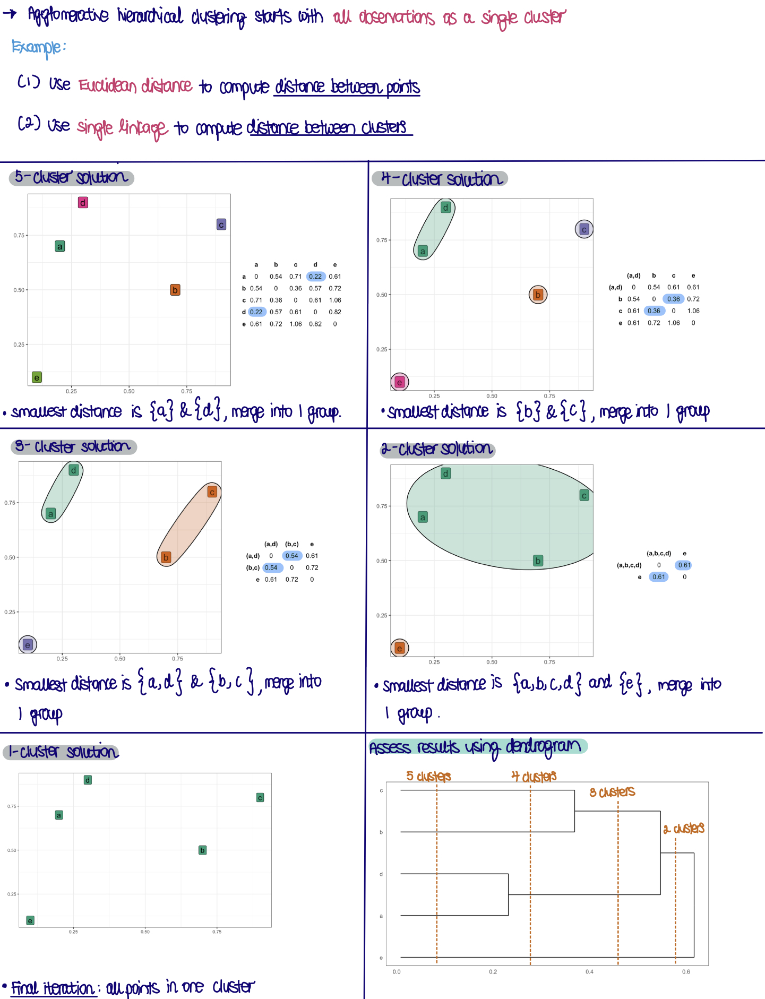
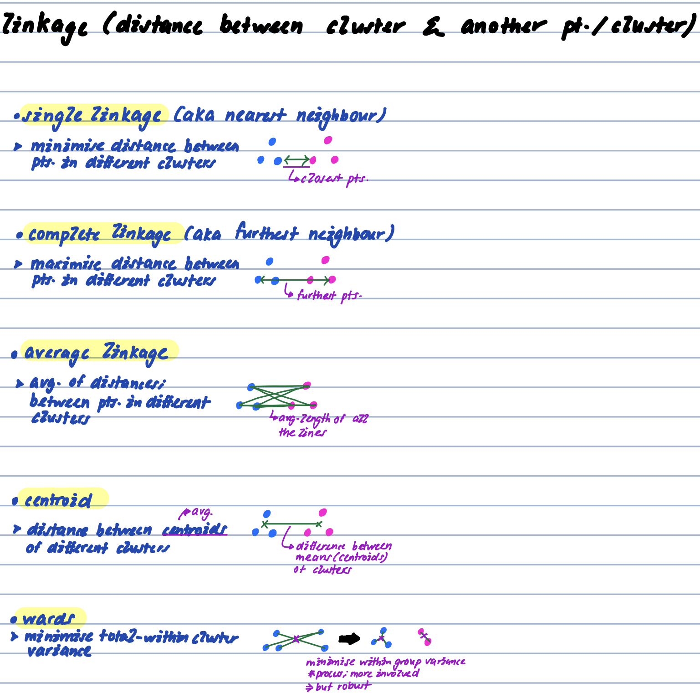
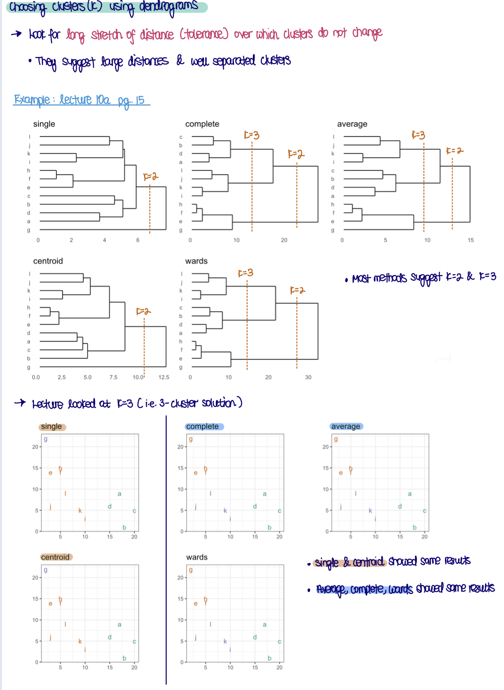
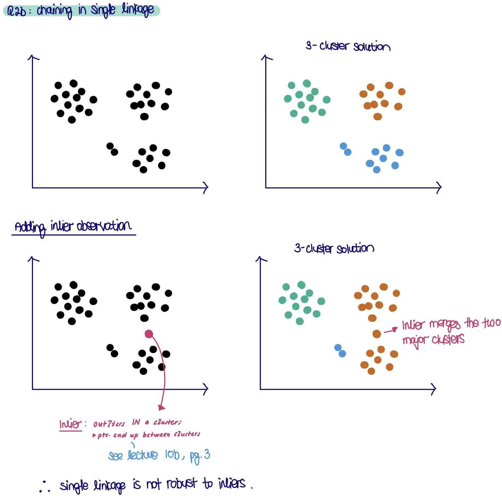
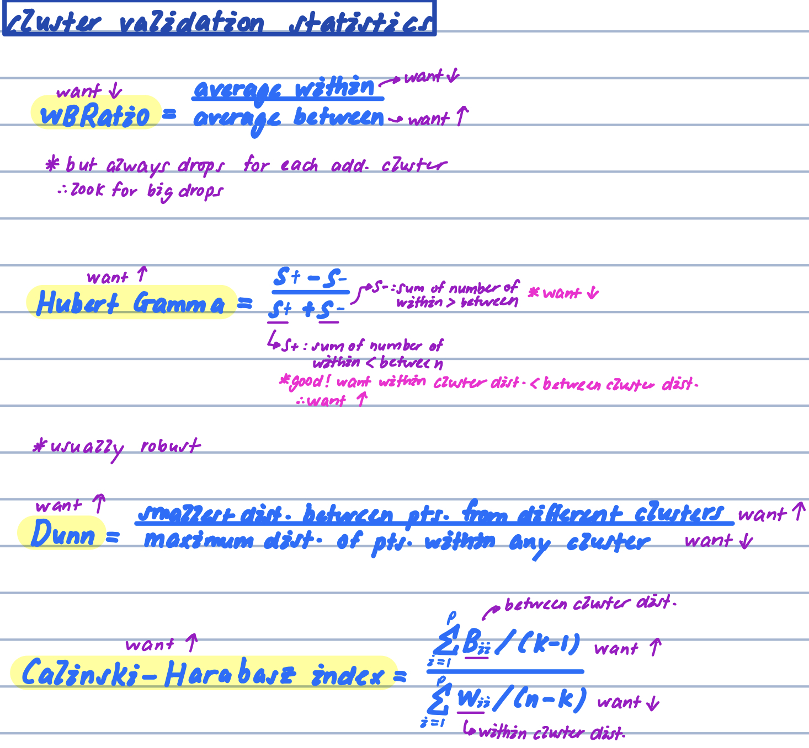
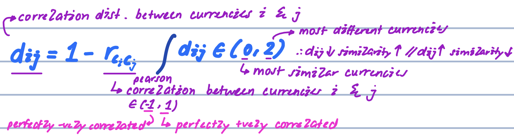

```{r setup, echo = FALSE, message = FALSE, warning = FALSE, warning = FALSE}
knitr::opts_chunk$set(
  message = FALSE,
  warning = FALSE,
  error = FALSE, 
  collapse = TRUE,
  comment = "#",
  fig.height = 4,
  fig.width = 8,
  fig.align = "center",
  cache = FALSE
)

library(tidyverse); ggplot2::theme_set(theme_bw())
library(tourr)
library(ggdendro)
library(fpc)
library(lubridate)
library(plotly)
```

## hierarchical clustering overview

      simple hclust example
```{r}

```

      different linkage methods
•linkage methods are used to compute distances between clusters and other clusters/observations.
```{r}

```

      illustration: choosing k (clusters) looking at dendogram
```{r}

```
      
      robustness + single & complete linkage drawbacks *not robust to in- & outliers
```{r}

```


## 1. Conduct cluster analysis on simple data

Use the flea data that comes in the `tourr` package, and where we know the true classes. This is the data also used in class examples.

### a. Standardise the variables and compute a hierarchical clustering using (i) Wards, (ii) single linkage. Make a plot of the dendrogram of each, and comment on how many clusters might be suggested by each.

      read in flea data + standardise variables
```{r}
# --- read in data
flea <- as_tibble(tourr::flea)

# create function to standardise variables
std <- function(x) (x - mean(x, na.rm = TRUE)) / sd(x, na.rm = TRUE)

# --- standardise variables
# flea_std <- flea %>%
#   mutate_if(is.numeric, std)

flea_std <- flea %>% 
  mutate(across(.cols = where(is.numeric),
                .fns = std))
```

      run hierarchical clustering; using ward's linkage + plot dendogram *ggdendro::ggdendogram
```{r}
# --- run hierarhcical clustering; using wards linkage

# compute dist. matrix
flea_hc_w <- stats::dist(x = flea_std[,1:6],
                         method = "euclidean",
                         diag = FALSE,
                         upper = FALSE) %>% 
  stats::hclust(method = "ward.D2") # use wards linkage

# --- plot dendogram
flea_hc_w %>% 
  ggdendro::ggdendrogram(rotate = TRUE, # horizontal
                         size = 4) # font size

# --- another way to plot dendogram
flea_hc_w %>% 
  as.dendrogram() %>% 
  plot(cex = 1) # set font size

flea_hc_w %>% 
  rect.hclust(k = 3)
```


      run hierarchical clustering; using single linkage + plot dendogram *ggdendro::ggdendogram
```{r}
# --- run hierarhcical clustering; using single linkage

# compute distnace matrix *input to `stats::hclust`
flea_hc_s <- stats::dist(x = flea_std[,1:6],
                         method = "euclidean",
                         diag = FALSE,
                         upper = FALSE) %>%
  stats::hclust(method = "single")

# --- plot dendogram
flea_hc_s %>% 
  ggdendrogram(rotate = TRUE, # horizontal 
               size = 4) # font size
```

**Wards linkage suggests three clusters. Single linkage would suggest more than this. It has something of a waterfall pattern, which is common when single linkage is used. This suggests that the data has a number of outliers, that is affecting the clustering of the majority of cases.**

### b. Choose two cut the dendrograms at the 3 cluster solutions for each, creating new columns corresponding to the cluster label. Using a grand tour, examine the cluster solutions. Comment on which one best captures the cluster structure.

      add cluster solution columns
```{r}
# --- `mutate` cluster solution columns 
flea_std <- flea_std %>%
  mutate(cl_w = stats::cutree(flea_hc_w, k = 3), # ward linkage
         cl_s = stats::cutree(flea_hc_s, k = 3)) # single linkage
```

      run grand tour; colour by cluster solutions
```{r eval=FALSE}
# --- run grand tour

tourr::animate_xy(data = flea_std[,1:6],
                  tour_path = grand_tour(),
                  col = flea_std$cl_w) # colour by hclust ward linkage cluster solution

tourr::animate_xy(data = flea_std[,1:6],
                  tour_path = grand_tour(),
                  col = flea_std$cl_s) # colour by hclust single linkage cluster solution
```

**The results from Wards linkage captures the three clusters that we see when we look at this 6D data in a tour. Its quite satisfying to see that it has discovered these clusters, based on interpoint distances.**

**The three cluster solution from single linkage has left all observations except two in one cluster. The two single points put in separate clusters could be considered to be outlying, in some directions in the 6D space. From the tour, you can see several more observations that might be considered to be outliers. If the single linkage dendrogram is cut further down, at 5 or 6 cluster solutions, these observations may also be placed in separate clusters, thus identifying them as outliers also.**

### c. Suppose the variables were not standardised. Would this have changed the cluster analysis? How? (Hint: compute the summary statistics for the variables.)

```{r}
summary(flea[,1:6])
```

**The results would change a lot! The variables have very different scales, eg tars1 ranges from 122-242 but aede2 only 8-16. This will affect the distances between points, and magnitude of distances will primarily be due to the variables with larger scale.**

## 2. Cluster statistics graduate programs 

Remember the National Research Council ranking of Statistics graduate programs data. This data contained measurements recorded on departments including total faculty, average number of PhD students, average number of publications, median time to graduate, and whether a workspace is provided to students. These variables can be used to group departments based on similarity on these characteristics.

### a. Read the data, handle missing values, select the variables that can be used, and standardise these variables.

```{r}
# --- read in `nrc` data
nrc <- read_csv(here::here("data/nrc.csv"))

# select relevant variables
nrc_vars <- nrc %>%
  dplyr::select(Institution.Name,
                Average.Publications:Student.Activities) %>%
  dplyr::select(-Academic.Plans.Pct) # remove variable; too many missings
 
# --- visualise missing values
visdat::vis_miss(nrc_vars,
                 sort_miss = TRUE,
                 cluster = TRUE)

nrc_vars <- nrc_vars %>%
  # replace na with 0; in these variables
  replace_na(list(Tenured.Faculty.Pct = 0, 
                  Instruction.in.Writing = 0,
                  Instruction.in.Statistics = 0,
                  Training.Academic.Integrity = 0,
                  Acad.Grievance.Proc = 0,
                  Dispute.Resolution.Proc = 0))

# summary(nrc_vars)
# Iteratively examine summary statistics to assess missings
# Academic.Plans.Pct has too many missings to use
# Other variables have 1-2 missings for different institutions, 
# can't just ignore them. Fill with 0 puts outside domain of
# observed data, on the end of "not done/available this program"
```

**The missing values were handled as follows. One variable (`Academic.Plans.Pct`) was dropped because it was missing for 19 departments. A handful of other variables were missing on one or two departments, BUT these were different departments for different variables. Removing them would have meant too many departments being dropped. We opted to input, and used a value of 0 which is just outside the range for each of these variables, and on the end of the range which meant that the department did not have these services.**

> note: generally; its NOT a good idea; replace `NA` with 0

### b. Use Euclidean distance and Wards linkage to conduct a cluster analysis. Draw the dendrogram. How many clusters does it suggest?

      mean normalise variables *always; before computing distance matri
```{r}
nrc_vars <- nrc_vars %>%
  # mutate_if(is.numeric, std)
  mutate(across(.cols = where(is.numeric),
                .fns = std)) # mean normalise function; created above
```

```{r}
# --- run hierarchical clustering

# compute distance matrix
nrc_hc_w <- stats::dist(x = nrc_vars[,-1], # remove `Institution.Name`
                        method = "euclidean",
                        diag = FALSE,
                        upper = FALSE) %>% 
  stats::hclust(method = "ward.D2") # wards linkage 

# --- plot dendogram
nrc_hc_w$labels <- nrc_vars$Institution.Name # add labels to `nrc_hc_w`; to plot in dendogram

ggdendro::ggdendrogram(data = nrc_hc_w,
                       rotate = TRUE, # horizontal
                       size = 2) # font size
```

**The dendrogram suggests anything from 2 through possibly 20 clusters. Its not conclusive, which is quite common for any cluster analysis.**

### intuition for cluster statistics *extra

      take a look at this plot. choose k clusters by eye
```{r}
tourr::flea %>% 
  ggplot(aes(x = tars1,
             y = aede1)) +
  geom_point() +
  theme(aspect.ratio = 1)
```

      what did we just do?
•use cluster statistics; to be more objective; but; same idea
```{r}

```

      cluster (validation) statistics are variants of the idea
```{r}

```
      

### c. For 2 through 10 clusters compute the cluster statistics, "within.cluster.ss","wb.ratio", "ch", "pearsongamma", "dunn", "dunn2". What would be the conclusion on the number of clusters based on these metrics?

> split the for loop into 2 


      (I) for loop; to extract cluster solutions from k = 2 to k = 10 *not required to answer this question; but in solutions
```{r, eval=FALSE}
# --- for loop; to extract cluster solutions from k = 2 to k = 10
nrc_hc_cl <- NULL

for (i in 2:10) {
  
  cl <- stats::cutree(tree = nrc_hc_w,
                      k = i)
  
  nrc_hc_cl <- cbind(nrc_hc_cl, cl)
}
```

      (II) for loop to compute cluster validation statistics *fpc::cluster.stats()
```{r}
# --- create storage vector
nrc_hc_cl_stats <- NULL


for (i in 2:10) { # for k = 2 to k = 10 clusters
  
  # extract cluster solutions
  cl <- stats::cutree(tree = nrc_hc_w,
                      k = i)
  
  # compute distance matrix
  x <- dist(nrc_vars[,-1],
            method = "euclidean") %>% 
    # compute cluster validation statistics
    fpc::cluster.stats(d = .,
                       clustering = cl) 
  
  # row bind results; for each iteration
  nrc_hc_cl_stats <- rbind(nrc_hc_cl_stats, 
                           c(i, 
                             x$within.cluster.ss, 
                             x$wb.ratio, 
                             x$ch, 
                             x$pearsongamma, 
                             x$dunn,
                             x$dunn2))
}

# set column names
colnames(nrc_hc_cl_stats) <- c("cl", # k: no. of clusters
                               "within.cluster.ss","wb.ratio", "ch", "pearsongamma", "dunn", "dunn2") # cluster validation statistics

# put results in tibble
nrc_hc_cl_stats <- as_tibble(nrc_hc_cl_stats)
```
      

      e.g. 1 iteration; for k = 3
```{r}
cl <- stats::cutree(tree = nrc_hc_w,
                    k = 3)

# compute distance matrix
x <- stats::dist(nrc_vars[,-1],
                 method = "euclidean") %>% 
  # compute cluster validation statistics
  fpc::cluster.stats(d = .,
                     clustering = cl)

# nrc_hc_cl <- cbind(nrc_hc_cl, cl) # bind cluster solutions; for k = 3

rbind(nrc_hc_cl_stats,
      c(3, 
        x$within.cluster.ss, 
        x$wb.ratio, 
        x$ch, 
        x$pearsongamma, 
        x$dunn,
        x$dunn2))
```


      plot results
•look for optimal pts. (& elbows if lack of peaks) *subjective
•ch = Calinski-Harabasz// dunn2 = dunn// Hubert Gamma = pearsongamma// dunn = variant of Dunn// wb.ratio// within.clusters.ss = within clusters sum of squares
```{r}
# --- pivot data into long form for plotting
nrc_hc_cl_stats_long <- nrc_hc_cl_stats %>% 
  pivot_longer(cols = -cl, 
               names_to ="stat",
               values_to = "value")

# --- plot results
nrc_hc_cl_stats_long %>% 
  ggplot(aes(x = cl,
             y = value)) + 
  geom_line() +
  geom_point() +
  labs(x = "k: # clusters",
       y = "") +
  # facet by cluster validation statistics
  facet_wrap(~ stat,
             ncol = 3,
             scales = "free_y") + 
  theme_bw()
```

**Its not definitive. Some of the metrics has a hint that 6 is reasonable. ("pearsongamma","wb.ratio" flatten.)**

**In general, this is just a guide, and 6 cluster might not be a useful solution. There are many variables used in the distance calculation. It would be good practice to choose a smaller set of variables, or primary interest, and examine the cluster solution. Then increase the number of variables and re-cluster and compare solutions.**

## 3. Cluster currencies using correlation distance

Here we will use cluster analysis on cross-rates date (previously examined with principal component analysis) to explore similar trending patterns. To examine trend a distance based on correlation will be used. Correlation between currencies is calculated and converted into a distance metric. 

### a. Read the data. Remove currencies whose cross-rate has not changed over the time period. 

```{r}
# --- read in raw data
rates <- read_csv(here::here("data/rates_Nov19_Mar20.csv"))

# --- compute currencies' cross-rates sd
rates_sd <- rates %>% 
  # pivot to long form
  pivot_longer(cols = AED:ZWL, 
               names_to = "currency", 
               values_to = "rate") %>%
  # compute sd for each currency
  group_by(currency) %>%
  summarise(s = sd(rate, 
                   na.rm = TRUE))

# keep only currencies with sd > 0 (i.e. remove currencies whose cross-rate have not changed)
keep <- rates_sd %>%
  filter(s > 0)

# --- final df
rates_sub <- rates %>%
  # standardise variables
  mutate(across(.cols = where(is.numeric),
                .fns = std)) %>% 
  # put data in long form
  pivot_longer(AED:ZWL, names_to = "currency", 
               values_to = "rate") %>%
   # keep only currencies with sd > 0
  dplyr::filter(currency %in% keep$currency) %>%
  # pivot to wide form
  pivot_wider(names_from = "date",
              values_from = "rate") 
```

### b. Standardise the rates for each currency, so all are on a scale of mean 0, sd 1. Why do you think this is necessary?

**It's actually not necessary for the distance calculation here, because correlation distance will automatically standardise observations. It's used purely to plot the currencies on the same scale at the end of the analysis to examine clusters.**

### c. Compute the correlation distance between each pair of currencies:

```{r}

```


$$d_{ij} = 1-r_{c_ic_j}$$
What is the range of this distance metric? What pattern would correspond to the most similar currencies, and what would correspond to most different?

**The distances will range from 0 through to 2. A value of 0 corresponds to the most similar currencies and 2 is most different. Note that 2 would mean that the currencies are perfectly negatively correlated.**

### d. Use hierarchical clustering using Wards linkage. Make a dendrogram. How many clusters does it suggest?

      compute correlation distance d_{ij} + create distance matrix
```{r}
# --- compute correlation distance

# --- compute r_{ij}
rates_cor <- stats::cor(t(rates_sub[,-1]), 
                        # use = "pairwise.complete.obs", # method for computing covariances; for missing values *not required actually; since no missing data
                        method = "pearson")

# --- compute distance matrix  = d_{ij} = 1 - r_{ij}
rates_cor_dist <- (1 - rates_cor) %>% # d_{ij} = 1 - r_{ij}
  stats::as.dist(m = ., # coerce matrix into distance matrix; to pass in `hclust` function
                 diag = FALSE,
                 upper = FALSE) 
```

      run hierarchical clustering with wards linkage
```{r}
rates_hc_w <- rates_cor_dist %>% # input correlation distance to hclust
  stats::hclust(d = .,
                method = "ward.D2") # ward linkage

# --- plot dendogram
rates_hc_w$labels <- rates_sub$currency # add labels to `nrc_hc_w`; to plot in dendogram

ggdendro::ggdendrogram(data = rates_hc_w,
                       rotate = TRUE, # horizontal
                       size = 2) # font size
```

**Anything from 2 through possibly 12 clusters. Two is strongly suggested but it wouldn't be a very useful clusters, because these would be two big heterogeneous groups.**

### e. Compute the cluster statistics. How many clusters would be suggested?

      (II) for loop; to compute cluster validation statistics *fpc::cluster.stats() *as per qn 2c
```{r}
rates_hc_cl_stats <- NULL # storage matrix

for (i in 2:20) { # for k = 2 to k = 20 clusters
  
  # extract cluster solutions *return vector `cl`
  cl <- cutree(tree = rates_hc_w, 
               k = i)
  
  # correlation distance matrix
  x <- rates_cor_dist %>% 
    # compute cluster validation statistics
    fpc::cluster.stats(d = ., 
                       clustering = cl)
  
  # row bind results; for each iteration
  rates_hc_cl_stats <- rbind(rates_hc_cl_stats, 
                             c(i, 
                               x$within.cluster.ss, 
                               x$wb.ratio, 
                               x$ch, 
                               x$pearsongamma,
                               x$dunn, 
                               x$dunn2))
}

# set column names
colnames(rates_hc_cl_stats) <- c("cl", "within.cluster.ss","wb.ratio", "ch", "pearsongamma", "dunn", "dunn2")

# put results in tibble
rates_hc_cl_stats <- as_tibble(rates_hc_cl_stats)
```

      plot results
```{r}
# --- pivot data into long form; for plotting
rates_hc_cl_stats_long <- rates_hc_cl_stats %>% 
  pivot_longer(cols = -cl, 
               names_to = "stat", 
               values_to = "value")

# plot results
rates_hc_cl_stats_long %>% 
  ggplot() + 
  geom_line(aes(x=cl, y=value)) + 
  labs(x = "k: # clusters",
       ylab = "") +
  # facet by cluster validation statistics
  facet_wrap(~stat, 
             ncol = 3,
             scales = "free_y") + 
  theme_bw()
```

**The cluster statistics pretty much all say two clusters. However, it wouldn't be a very useful clusters, because these would be two big heterogeneous groups.**

### f. Make a choice of final number of clusters, and plot the currencies over time, grouped by cluster. Comment on currencies that have similar patterns, in at least one cluster.

      (I) for loop; to extract cluster solutions from k = 2 to k = 20
```{r}
# --- run for loop; extract cluster solutions from k = 2 to k = 20
rates_hc_cl <- NULL # initialise empty matrix

# *returns matrix: 154 obs. x 19 (k = 2 to k = 20) cluster solutions 
for(i in 2:20){ # for k = 2 to k = 20 clusters
  
  # extract cluster solutions
  cl <- stats::cutree(tree = rates_hc_w,
                      k = i)
  
  # bind results 
  rates_hc_cl <- cbind(rates_hc_cl, cl)
}

# --- use tibble (prints nicer & easier to work with) *optinal
rates_hc_cl <- as_tibble(rates_hc_cl) 

names(rates_hc_cl) <- paste(2:20) # rename columns
```

      plot results for k = 7
```{r fig.height = 10, fig.width = 8, out.width="100%"}
rates_sub_long <- rates_sub %>%
  mutate(cl = rates_hc_cl %>% pull(`7`)) %>% # add k = 7 cluster solution
  # pivot data in long form for plotting
  pivot_longer(`2019-11-01`:`2020-03-31`, 
               names_to = "date", 
               values_to = "rate") %>%
  mutate(date = lubridate::ymd(date)) # coerce date into `date` variable type

# --- plot clusters
p <- rates_sub_long %>% 
  ggplot(aes(x = date,
             y = rate, 
             group = currency)) + # each currency is a single line
  geom_line() + 
  # facet by class *from cluster solutions
  facet_wrap(~cl,
             ncol = 1,
             scales = "free")

plotly::ggplotly(p)
```

      count the no. of currencies in each cluster
```{r}
rates_sub_long %>% 
    distinct(currency, .keep_all = TRUE) %>% 
    count(cl)
```

**We think about 7 clusters makes a reasonable break on the dendrogram. This reveals some nicely similar groups of currencies. Particularly, cluster 3 shows a group of currencies that all decline relative to the USD as the pandemic broke, and then recovered towards the end of March. Cluster 1 contains currencies who basically stayed flat during the period, except for an occasional spurious jump. Cluster 4 contains currencies that were quite flat but increasing relative to the USD in the last part of the time period.**

**The clustering has returned some convenient grouping of currencies based on the trends over the time period.**


##### © Copyright 2021 Monash University
