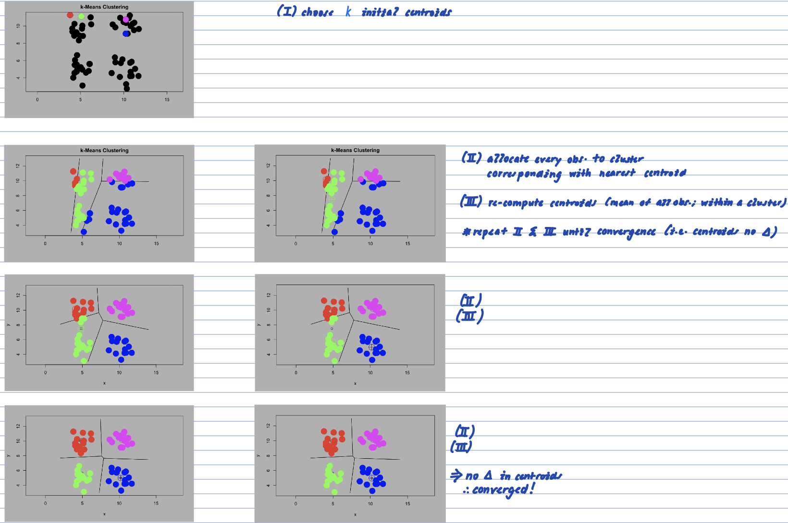

```{r setup, echo = FALSE, message = FALSE, warning = FALSE, warning = FALSE}
knitr::opts_chunk$set(
  message = FALSE,
  warning = FALSE,
  error = FALSE, 
  collapse = TRUE,
  comment = "#",
  fig.height = 4,
  fig.width = 8,
  fig.align = "center",
  cache = FALSE
)

library(emo)
library(tidyverse); ggplot2::theme_set(theme_bw())
library(tourr)
library(ggdendro)
library(fpc)
library(GGally)
library(kableExtra)
```

## k-means clustering illustration
      
      illustration of how k-means work    
```{r}

```

      robustness of kmeans *nstart (not in tutorial)
•here, we are fitting k-means; iterating 1 time, 2 times, ..., 12 times; then plotting the results
-> $W(C_k)$ represents the within-cluster sum of squares
•try changing values of `nstart` we will see that it gets more robust with higher `nstart` value as $W(C_k)$ becomes rather fixed even as we iterate more times
```{r fig.height=15, fig.width=18}
# --- generate data; from normal distribution
df <- data_frame(
    x1 = c(rnorm(n = 100), rnorm(n = 100) + 3),
    x2 = c(rnorm(n = 100), rnorm(n = 100) - 2)
)

# --- compute and plot results
map(1:12, ~ kmeans(df, 
                   centers = 3,
                   nstart = 25)) %>% # << attempts multiple(25) initial configurations & reports on the best one (minimises within cluster ss)
  map2_dfr(1:12, ~ df %>% mutate(
    cluster = .x$cluster,
    name = paste0("Iteration: ", .y, ";  W(Ck): ", round(.x$tot.withinss, 2))
    )) %>%
  ggplot(aes(x = x1,
             y = x2, 
             colour = cluster)) +
  geom_point(show.legend = FALSE, size = 1) +
  facet_wrap(~name, 
             nrow = 2)
```


## 1. Conduct cluster analysis on simple data

Use the flea data that comes in the `tourr` package, and where we know the true classes. This is the data also used in class examples.

### a. Produce the clustering into three groups from (i) Wards, (ii) $k$-means, $k=3$, and make a confusion table to compare the two results.

#### read in data

      read in data + standardise variables
```{r}
data(flea) # tourr::flea data

# --- (I) standardise varaibles
std <- function(x) (x-mean(x, na.rm=TRUE))/sd(x, na.rm=TRUE)

flea_std <- flea %>%
  mutate(across(.cols = where(is.numeric),
                .fns = std))
```


#### run hierarchical clustering

      run hierarchical clustering
```{r}
# --- (II) (III) compute distance matrix + pass as input into `stats::hclust`
flea_hc_w <- stats::dist(flea_std[,2:7]) %>% 
  stats::hclust(method = "ward.D2")
```
#### run k-means clustering

      run kmeans clustering
```{r}
set.seed(2021) # set seed for reproducibility (kmeans have initialise at different random starts)

# --- (II) run k-means clustering
flea_km <- stats::kmeans(flea_std[,2:7],
                         centers = 3) # 3 clusters
```


      how to choose k for k-means clustering? *not in tutorial
•plot total within sum of squares against number of clusters $k$
-> typically; sum of squares decrease as k increase
-> so we find elbow
```{r}
# factoextra::fviz_nbclust helper function; used; visualise & determine the optimal k
factoextra::fviz_nbclust(x = tourr::flea %>% select(-species),
                         FUNcluster = kmeans,
                         method = "wss", # within cluster ss
                         k.max = 10) # max no. of clusters to consider
```
      
#### compare results

      map cluster labels to obs. from both methods 
```{r}
flea_std <- flea_std %>%
  mutate(cl_w = stats::cutree(flea_hc_w, k = 3), # extract cluster solution from hclust; k = 3
         cl_km = flea_km$cluster) # extract cluster solutions from k-means; k = 3
```

      compute confusion table; compare both results
•note: labels doesn't matter
```{r}
flea_std %>% 
  count(cl_w, cl_km) %>% # compute agreemeent
  # pivot into wide form; create confusion table
  pivot_wider(names_from = cl_w, 
              values_from = n, 
              values_fill = 0) %>% 
  rename("cl_km/cl_wards" = cl_km)
```

### b. Map the cluster labels from the two results, and calculate the agreement. 

**Wards 1 = km 1, Wards 2 = km 3, Wards 3 = km 2. Agreement is (29+19+22)/74 = 0.94, which is very high.**

## 2. Cluster statistics graduate programs 

Remember the National Research Council ranking of Statistics graduate programs data. This data contained measurements recorded on departments including total faculty, average number of PhD students, average number of publications, median time to graduate, and whether a workspace is provided to students. These variables can be used to group departments based on similarity on these characteristics.

### a. Read the data, handle missing values, select the variables that can be used, and standardise these variables. Use Euclidean distance and Wards linkage to conduct a cluster analysis, on the full set of variables, and on a reduced set of Average.Publications, Average.Citations, Faculty.with.Grants.Pct, Awards.per.Faculty, Median.Time.to.Degree, Ave.GRE.Scores. Make a confusion matrix to compare the six cluster results from the full set, and the five cluster result from the reduced set (Hubert and wb.ratio suggest 5 clusters). 

```{r}
# --- read the data
nrc <- read_csv(here::here("data/nrc.csv"))

nrc_vars <- nrc %>%
  # select relevant variables
  dplyr::select(Institution.Name,
                Average.Publications:Student.Activities) %>%
  dplyr::select(-Academic.Plans.Pct) %>% # remove; too many missings
  # replace NA values with 0 
  replace_na(list(Tenured.Faculty.Pct = 0, 
                  Instruction.in.Writing = 0,
                  Instruction.in.Statistics = 0,
                  Training.Academic.Integrity = 0,
                  Acad.Grievance.Proc = 0,
                  Dispute.Resolution.Proc = 0))

# --- (I) first step to clustering; always standardise our variables
nrc_vars_std <- nrc_vars %>%
  mutate(across(.cols = where(is.numeric),
                .fns = std))
```

#### run hierarchical clustering on full data

      run hierarchical clustering on full set of variables + plot dendogram
•using euclidean distance
•using wards linkage
•chose k = 6
-> recall last tutorial: cluster validation statistics (Hubert gamma optimised & wb.ratio elbow at k=6)
```{r}
# --- run hierarchical clustering
# (II) compute distance matrix (III) pass it as input to `stats::hclust`
nrc_hc_w1 <- stats::dist(nrc_vars_std[,-1],
                         method = "euclidean") %>% 
  stats::hclust(method = "ward.D2")

# --- draw dendogram
nrc_hc_w1$labels <- nrc_vars$Institution.Name # add labels *note: won't actually have these labels (unsupervised classification)

# using ggdendro::ggdendrogram
ggdendro::ggdendrogram(nrc_hc_w1,
                       rotate = TRUE,
                       size = 2) 

# another way to plot dendogram
# using `plot` method *easier to view cluster solutions
nrc_hc_w1 %>% 
  as.dendrogram() %>% 
  plot(cex = 1) # set font size

nrc_hc_w1 %>% 
  rect.hclust(k = 6)

# yet another way
factoextra::fviz_dend(x = nrc_hc_w1,
                      k = 6,
                      k_colors = c("#2E9FDF", "#00AFBB", "#E7B800", "#FC4E07"),
                      color_labels_by_k = TRUE, 
                      rect = TRUE,
                      rect_fill = TRUE,
                      ggtheme = theme_bw())
```

      run cluster validation statistics on hclust ran on subset of data + plot results
*same as last week
```{r}
# === compute validation stats.

# --- create storage vector
nrc_hc_cl_stats <- NULL


for (i in 2:10) { # for k = 2 to k = 10 clusters
  
  # extract cluster solutions
  cl <- stats::cutree(tree = nrc_hc_w1,
                      k = i)
  
  # compute distance matrix
  x <- dist(nrc_vars[,-1],
            method = "euclidean") %>% 
    # compute cluster validation statistics
    fpc::cluster.stats(d = .,
                       clustering = cl) 
  
  # row bind results; for each iteration
  nrc_hc_cl_stats <- rbind(nrc_hc_cl_stats, 
                           c(i, 
                             x$within.cluster.ss, 
                             x$wb.ratio, 
                             x$ch, 
                             x$pearsongamma, 
                             x$dunn,
                             x$dunn2))
}

# set column names
colnames(nrc_hc_cl_stats) <- c("cl", # k: no. of clusters
                               "within.cluster.ss","wb.ratio", "ch", "pearsongamma", "dunn", "dunn2") # cluster validation statistics

# put results in tibble
nrc_hc_cl_stats <- as_tibble(nrc_hc_cl_stats)

# === plot results
# --- pivot data into long form for plotting
nrc_hc_cl_stats_long <- nrc_hc_cl_stats %>% 
  pivot_longer(cols = -cl, 
               names_to ="stat",
               values_to = "value")

# --- plot results
nrc_hc_cl_stats_long %>% 
  ggplot() + 
  geom_line(aes(x = cl,
                y = value)) +
  labs(x = "k: # clusters",
       y = "") +
  # facet by cluster validation statistics
  facet_wrap(~ stat,
             ncol = 3,
             scales = "free_y") + 
  theme_bw()
```
> its not definitive; some of metrics has a hint that 6 is reasonable (”pearsongamma” peak// “wb.ratio” flatten)
-> in general; this is just a guide & 6 cluster might not be a useful solution


#### subset of data

      run hclust on subset of variables
•using euclidean distance
•using wards linkage
•chose k = 5
```{r}
# --- run hierarchical clustering
# (II) compute distance matrix (III) pass it as input to `stats::hclust`
nrc_hc_w2 <- stats::dist(nrc_vars_std[,c(2,3,4,5,8,17)], # only on relevant variables
                         method = "euclidean") %>% 
  stats::hclust(method = "ward.D2")

# --- draw dendogram
nrc_hc_w2$labels <- nrc_vars$Institution.Name # add labels *note: won't actually have these labels (unsupervised classification)

# using ggdendro::ggdendrogram
ggdendro::ggdendrogram(nrc_hc_w2,
                       rotate = TRUE,
                       size = 2) 

# another way to plot dendogram
# using `plot` method *easier to view cluster solutions
nrc_hc_w2 %>% 
  as.dendrogram() %>% 
  plot(cex = 1) # set font size

nrc_hc_w2 %>% 
  rect.hclust(k = 5)

# yet another way
factoextra::fviz_dend(x = nrc_hc_w2,
                      k = 5,
                      k_colors = c("#2E9FDF", "#00AFBB", "#E7B800", "#FC4E07"),
                      color_labels_by_k = TRUE, 
                      rect = TRUE,
                      rect_fill = TRUE,
                      ggtheme = theme_bw())
```

      run cluster validation statistics on hclust ran on subset of data + plot results
*same as last week
```{r eval=FALSE, echo=FALSE}
nrc_hc_cl_stats <- NULL # --- create storage vector/matrix

for (i in 2:10) { # for k = 2 to k = 10 clusters
  
  # extract cluster solutions
  cl <- stats::cutree(tree = nrc_hc_w2, 
                      k = i)
  
  # compute distance matrix
  x <- dist(nrc_vars_std[,c(2,3,4,5,8,17)]) %>% 
    # compute validation statistics
    fpc::cluster.stats(d = ., 
                       cl) # input cluster solutions
  
  # row bind results; for each iteration
  nrc_hc_cl_stats <- rbind(nrc_hc_cl_stats, 
                           c(i, 
                             x$within.cluster.ss, 
                             x$wb.ratio, 
                             x$ch, 
                             x$pearsongamma, 
                             x$dunn,
                             x$dunn2))
}

# --- set column names
colnames(nrc_hc_cl_stats) <- c("cl", # k: no. of clusters
                               "within.cluster.ss","wb.ratio", "ch", "pearsongamma", "dunn", "dunn2") # cluster validation statistics

# put results in tibble
nrc_hc_cl_stats <- as_tibble(nrc_hc_cl_stats)

# --- plot results

# pivot data into long form for plotting
nrc_hc_cl_stats_long <- nrc_hc_cl_stats %>% 
  pivot_longer(cols = -cl, 
               names_to ="stat", 
               values_to = "value")

# --- plot results
nrc_hc_cl_stats_long %>% 
  ggplot() + 
  geom_line(aes(x=cl, y=value)) + 
  xlab("# clusters") + ylab("") +
  facet_wrap(~stat, ncol=3, scales = "free_y") + 
  theme_bw()
```

> its not definitive; some of metrics has a hint that 5 is reasonable (”pearsongamma” peak// “wb.ratio” flatten)
-> in general; this is just a guide & 5 cluster might not be a useful solution

#### comparing results
```{r}
# --- mutate cluster solutions
nrc_vars <- nrc_vars %>%
  mutate(cl_w1 = cutree(nrc_hc_w1, k = 6), # k = 6 cluster solution; from hclust on full set
         cl_w2 = cutree(nrc_hc_w2, k = 5)) # k = 6 cluster solution; from hclust on subset

# --- compute confusion matrix
nrc_vars %>% 
  count(cl_w1, cl_w2) %>% # compute agreeement
  # pivot into wide form (confusion matrix)
  pivot_wider(names_from = cl_w1, 
              values_from = n, 
              values_fill = 0) %>% 
  # label top left column
  rename("cl_w2/cl_w1" = cl_w2)
```


### b. Map the cluster labels from the two results, and calculate the agreement. 

**w2 cluster 2 most matches w1 cluster 3, w2 cluster 3 most matches w1 cluster 1 BUT beyond this it's not possible to map the two solutions. The two solutions REALLY don't agree.**

### c. Draw a scatterplot matrix (or a parallel coordinate plot) of the results from the smaller subset of variables. Describe how the clusters differ from each other.

> 3 ways; visualise cluster solution
  > on hclust run on smaller subset


      (I) scatterplot matrix
```{r fig.height=6, fig.width=6, out.width="80%"}
nrc_vars <- nrc_vars %>% 
  mutate(cl_w2 = factor(cl_w2)) # coerce to factor variable

# --- plot scatterplot matrix
GGally::ggscatmat(nrc_vars,
                  columns = c(2,3,4,5,8,17), # select subset of variables
                  color = "cl_w2") + # colour by cluster solution
  theme_bw()
```
      
      
      (II) parallel coordinate plots
```{r eval = FALSE, echo = FALSE}
# --- parallel coordinate plot
GGally::ggparcoord(nrc_vars, 
                   columns = c(2,3,4,5,8,17), # select relevant variable
                   groupColumn = 51, # colour by cluster soln.
                   order = "anyClass") + # tries to order variables by separation between any one class & the rest
  facet_wrap(~nrc_vars$cl_w2, 
             ncol = 1) +
  theme(legend.position = "none") +
  theme_bw()

# who's that single observation in cluster 5?
nrc_vars %>% 
  filter(cl_w2 == 5) %>%
  select(Institution.Name)
```

      (III) tour *not in tutorial
```{r}
tourr::animate_xy(data = nrc_vars[,c(2,3,4,5,8,17)],
                  tour_path = grand_tour(),
                  col = nrc_vars$cl_w2)
```
      

**This is a very difficult clustering problem because there are no naturally separated clusters in the data.**

**Cluster 5, which has only one observation (Stanford University) which is an outlier relative to the other institutions. It has a large number of awards per faculty, and also a high publication and citation rate.**

**Cluster 1 tends to have low average GRE scores (entrance exams for graduate students), but is otherwise mixed values on other variables.**

**Cluster 2 tends to have higher publication and citation rates, and mode faculty with grants.**

**Cluster 3 has relatively low time to degree, high GRE scores, and low average publications/ citation rates.**

**Cluster 4 has relatively high median time to degree, but mixed on other variables.**

### d. Compute the means of the clusters. Describe how the clusters differ from each other, based on these values.

      compute mean values of each variable; for each cluster
```{r}
# --- compute mean values for each variable; for each cluster
nrc_means <- nrc_vars %>% 
  # select subset of variables
  select(Average.Publications, Average.Citations, Faculty.with.Grants.Pct, Awards.per.Faculty, Median.Time.to.Degree, Ave.GRE.Scores, cl_w2) %>%
  group_by(cl_w2) %>% # group by cluster solution
  # compute mean
  dplyr::summarise(across(.cols = where(is.numeric),
                          .fns = mean))

# --- nice kable
nrc_means %>% 
  kable(digits=2) %>% 
  kable_styling(bootstrap_options = "basic", 
                font_size = 16, 
                stripe_color = "#FFFFFF") %>%
  row_spec(0, 
           color = "white", 
           background = "#505050") 
```

      can draw parallel coordinate plot of mean values *not in tutorial
```{r}
nrc_means %>% 
  GGally::ggparcoord(columns = c(2:7), # select relevant variable
                     groupColumn = 1, # colour by cluster soln.
                     order = "anyClass") +  # tries to order variables by separation between any one class & the rest
  geom_point() +
  theme(legend.position = "bottom") +
  theme_bw()
```

**Similar summary to what is learned from the plots.**

**Cluster 5 (just the one institution) is highly rated for faculty, and students.**

**Cluster 2 has high scores for faculty, but less impressive (similar to other clusters) records for students.**

**Cluster 4 has low scores for faculty, and although tends to recruit high-performing students, it takes them longer to graduate. These might not be the best institutions to attend as a graduate students.**

**Clusters 1 and 3 score moderately on most of the metrics with cluster 3 generally slightly higher for both faculty and students.**

##### © Copyright 2021 Monash University
